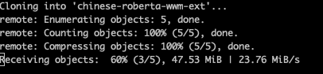
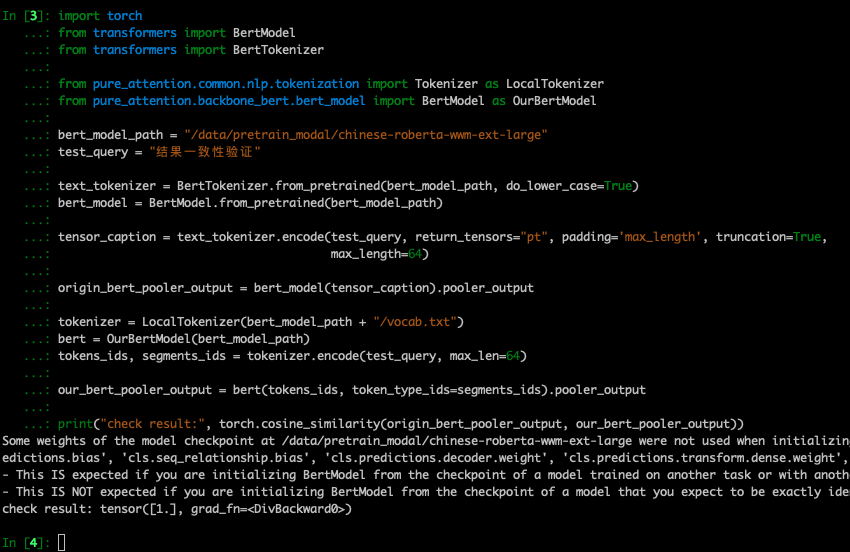

# 介绍
[transformers](https://github.com/huggingface/transformers) 为了适应非常多种模型结构，结构变得非常复杂。

我在参考
[transformers](https://github.com/huggingface/transformers) 、 
[bert4pytorch](https://github.com/MuQiuJun-AI/bert4pytorch) 、
[Read_Bert_Code](https://github.com/DA-southampton/Read_Bert_Code)
的代码基础上，对结构进行了一些调整，提高了代码的易读性，并和 [transformers](https://github.com/huggingface/transformers) 的结果完全一致。

# transformers国内下载镜像

关于 lfs，可以参考 [git lfs](https://git-lfs.github.com/) 。


|  模型名称   | git clone  |  自行下载  |
|  ----  | ----  | ----  |
| [bert-base-chinese](https://huggingface.co/bert-base-chinese)  | `git clone git@e.coding.net:mmmwhy/file/bert-base-chinese.git` | https://mmmwhy.coding.net/public/file/bert-base-chinese/git/files |
| [chinese-roberta-wwm-ext](https://huggingface.co/hfl/chinese-roberta-wwm-ext)  | `git clone git@e.coding.net:mmmwhy/file/chinese-roberta-wwm-ext.git` | https://mmmwhy.coding.net/public/file/chinese-roberta-wwm-ext/git/filess |
| [chinese-roberta-wwm-ext-large](https://huggingface.co/hfl/chinese-roberta-wwm-ext-large)  | `git lfs clone git@e.coding.net:mmmwhy/file/chinese-roberta-wwm-ext-large.git` | https://mmmwhy.coding.net/public/file/chinese-roberta-wwm-ext-large/git/files |
| [ernie 1.0](https://huggingface.co/nghuyong/ernie-1.0)  | `git clone git@e.coding.net:mmmwhy/file/ernie-1.0.git` | https://mmmwhy.coding.net/public/file/ernie-1.0/git/files |

速度还是比较可观的，




# 使用
1、安装本仓库 `pip install --upgrade pure_attention`  

2、下载预训练模型

3、开始使用
```python
from pure_attention.common.nlp.tokenization import Tokenizer
from pure_attention.backbone_bert.bert_model import BertModel

bert_model_path = "/data/pretrain_modal/bert-base-chinese"
test_query = "结果一致性验证"

tokenizer = Tokenizer(bert_model_path + "/vocab.txt")
bert = BertModel(bert_model_path)

tokenizer_output= tokenizer.encode(test_query, max_len=64)

our_bert_pooler_output = bert(
  input_ids=tokenizer_output.input_ids, 
  token_type_ids=tokenizer_output.token_type_ids, 
  attention_mask=tokenizer_output.attention_mask).pooler_output

bert_last_hidden_state = bert(
  input_ids=tokenizer_output.input_ids, 
  token_type_ids=tokenizer_output.token_type_ids, 
  attention_mask=tokenizer_output.attention_mask).last_hidden_state


```


# 结果一致性
分别在下边三个常用中文 bert 上进行测试，结果与 transformers 完全一致。
- [bert-base-chinese](https://huggingface.co/bert-base-chinese)
  
  
  

- [chinese-roberta-wwm-ext](https://huggingface.co/hfl/chinese-roberta-wwm-ext)
  
  
  

- [chinese-roberta-wwm-ext-large](https://huggingface.co/hfl/chinese-roberta-wwm-ext-large)
  
  
  

- [ernie](https://huggingface.co/nghuyong/ernie-1.0)
  
  
  

```python
import torch
from transformers import BertModel
from transformers import BertTokenizer


bert_model_path = "/data/pretrain_modal/chinese-roberta-wwm-ext-large"
test_query = "结果一致性验证"

text_tokenizer = BertTokenizer.from_pretrained(bert_model_path, do_lower_case=True)
bert_model = BertModel.from_pretrained(bert_model_path)

tensor_caption = text_tokenizer(test_query, return_tensors="pt", padding='max_length', truncation=True,
                                       max_length=64)


origin_bert_pooler_output = bert_model(
  input_ids=tensor_caption.input_ids,
  attention_mask=tensor_caption.attention_mask,
  token_type_ids=tensor_caption.token_type_ids).pooler_output

# 我们简化重构后的代码
from pure_attention.common.nlp.tokenization import Tokenizer as LocalTokenizer
from pure_attention.backbone_bert.bert_model import BertModel as OurBertModel
tokenizer = LocalTokenizer(bert_model_path + "/vocab.txt")
bert = OurBertModel(bert_model_path)
tokenizer_output = tokenizer.encode(test_query, max_len=64)

our_bert_pooler_output = bert(
  input_ids=tokenizer_output.input_ids, 
  token_type_ids=tokenizer_output.token_type_ids, 
  attention_mask=tokenizer_output.attention_mask).pooler_output


print("check result:", torch.cosine_similarity(origin_bert_pooler_output, our_bert_pooler_output))
```